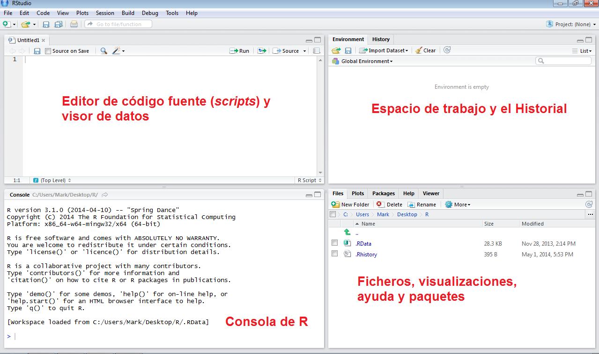
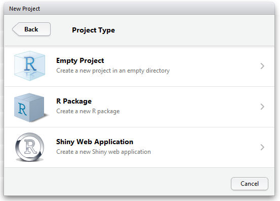
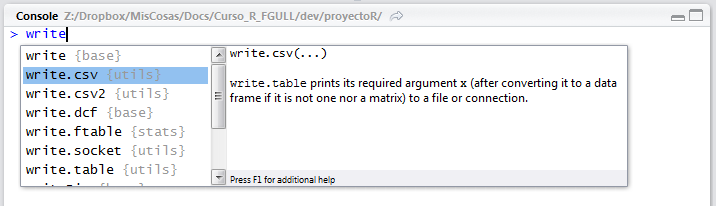
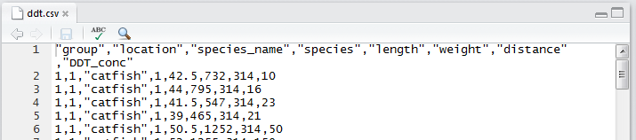
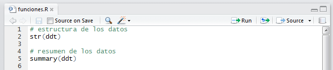
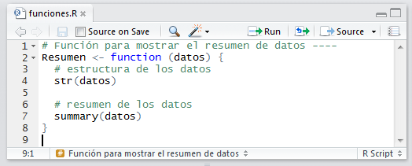
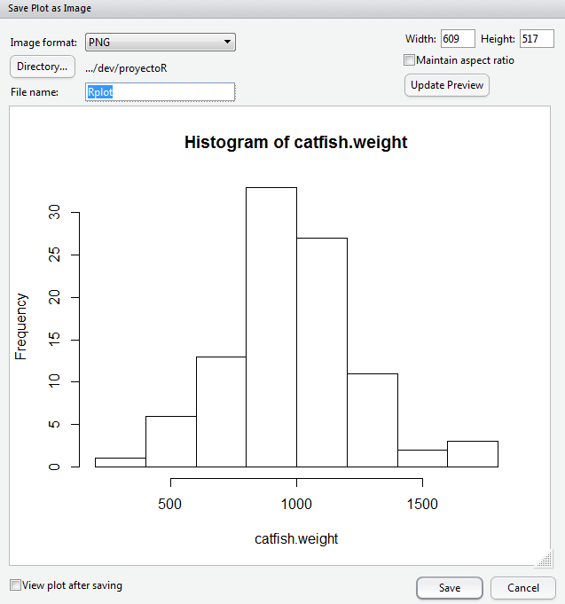
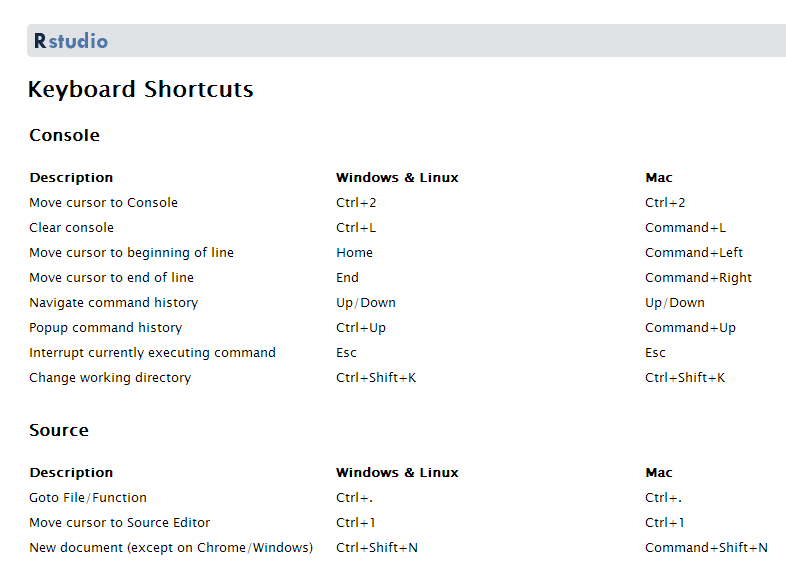
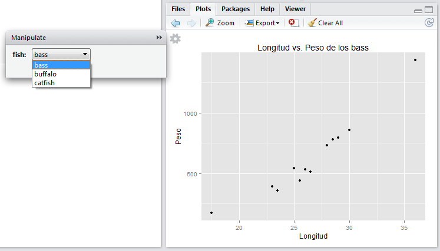

% Curso introductorio de  </br> Introducción a la interfaz RStudio
% Profesores: </br> Carlos Pérez González </br> Marcos Colebrook Santamaría </br> (curso de la Fundación General ULL) 
% 2014


# Contenidos
* ¿Qué es RStudio?
* Vistazo rápido y características de RStudio
* Instalación de RStudio
* Descripción del entorno
* Primer proyecto dentro de RStudio
* Cargar y guardar datos en el proyecto
* Gestión del historial
* Primer script en RStudio
* Usando la ayuda
* Extracción y ejecución de funciones
* Secciones, plegado y navegación de código
* Visualización de datos
* Los comandos `plot`, `qplot` y `manipulate`
* Instalación de paquetes en RStudio
* Generando informes HTML a partir de scripts de R
* Atajos de teclado
* Ejercicios
* Futuro de RStudio
* Referencias


# ¿Qué es RStudio?
* RStudio es una herramienta __IDE (_Integrated Development Environment_)__ para __R__, libre y gratuita que facilita:
    * Trabajar con R y gráficos de R de forma interactiva.
    * Organizar el código y mantener múltiples proyectos.
    * Mantenimiento de los paquetes de R.
    * Crear y compartir informes.
    * Compartir código y colaborar con otros usuarios.
* RStudio fue fundado por J.J. Allaire, y también es una empresa que se dedica a vender servicios de consultoría y formación.
* RStudio __NO__ realiza ninguna operación estadística. Solo facilita realizar dichas operaciones sobre R.

<center>
 
</center>


# Características de RStudio

* Integración de la consola de R: se pueden teclear comandos de R directamente en la consola de RStudio.
* Ejecución de código: permite ejecutar código directamente del fichero de script.
* Resaltado de la sintaxis: realiza una coloración automática de los instrucciones y de las funciones.
* Ayuda con los paréntesis, corchetes y comillas: autocompleta estos símbolos al abrirlos.
* Completado de comandos: completa los comandos mientras se escriben usando la tecla `Tab`.
* Atajos de teclado.
* Navegador de objetos: se pueden inspeccionar todos los objetos de la sesión R.
* Gestión del historial de comandos: para poder usarlos de nuevo.
* Navegación del código: permite saltar entre funciones dentro del código.
* Importación y visualización de datos: en formato de tabla.
* Integración de gráficos: manipulación, zoom y exportación.
* Gestión de proyectos: se puede cambiar de un proyecto a otro fácilmente.
* Control de versiones: se integra bien con `git` y `svn`.
* Generación de documentos: del tipo PDF, HTML y otros más avanzados con un solo click.


# Instalación de RStudio
* Antes de instalar RStudio, necesitas instalar __R__. Se puede obtener desde:
    * [cran.r-project.org](http://cran.r-project.org)
* Una vez instalado R, se puede instalar RStudio en tu ordenador (versión __Desktop__) dependiendo del sistema operativo:
    * [www.rstudio.com/ide/download/desktop](http://www.rstudio.com/ide/download/desktop)
* Solo en Linux, también se puede instalar __RStudio Server__, el cual permite acceder al entorno desde un navegador web:
    * [www.rstudio.com/ide/server](http://www.rstudio.com/ide/server)


# Descripción del entorno
* Editor de código fuente (scripts) y visor de datos: permite editar código fuente R y ver los datos del tipo data.frame.
* Espacio de trabajo e historial: muestra los objetos (datos/variables) usados en la sesión actual y el historial de comandos.
* Consola R: permite trabajar con R directamente.
* Ficheros, visualizaciones, ayuda y paquetes: permite navegar por los ficheros y carpetas, mostrar los gráficos y visualizaciones, usar la ayuda, e instalar paquetes o cargar paquetes ya instalados.
* Todos los paneles permiten ser minimizados o maximizados, como ventanas normales de Windows.

<center>

</center>


# Primer proyecto dentro de RStudio
* Para crear un proyecto, vamos a la esquina derecha de la barra de herramientas:

<center>
 
</center>

* También podemos hacer lo mismo desde __File > New Project...__
* Le vamos a poner el nombre __proyectoR__.

<center>




</center>


# Directorios del proyecto
* Normalmente, para proyectos simples, podemos poner todos los ficheros (scripts de R, datos, docs, informes, etc) en la misma carpeta del proyecto.
* Sin embargo, es una buena práctica, crear los siguientes directorios en cada proyecto:
    * `R`: contendrá los scripts de R que se vayan desarrollando.
    * `data`: almacenará los datos necesarios para realizar los análisis.
    * `doc`: contendrá toda la documentación necesario para los análisis.
    * `informes`: carpeta que guardará los informes generados por los análisis.
* En principio, solo vamos a crear las carpetas `R` y `data`.

* Vamos al panel de ficheros:

<center>

</center>

* Hacemos clic en __New Folder__, y le damos el nombre `R`.
* Haremos lo mismo para crear la carpeta `data`.
* Por tanto, la carpeta del proyecto quedaría como:

<center>

</center>


# Cargar datos en el proyecto
* Vamos a cargar unos datos para poder empezar a trabajar:

<center>

</center>

* Aquí podemos elegir:
    * Cargar los datos desde un fichero de texto (__From Text File…__).
    * O desde una URL de una web (__From Web URL…__).

* Desde esta URL podemos descargar el fichero ```ddt.txt```, o usarla directamente:
    * [http://mcolebrook.github.io/CursoRStudio/data/ddt.csv](http://mcolebrook.github.io/CursoRStudio/data/ddt.csv)

<!---
[http://dl.dropboxusercontent.com/u/27980918/RStudio/ddt.txt](http://dl.dropboxusercontent.com/u/27980918/RStudio/ddt.txt)
--> 


# El fichero `ddt.txt`
* En este archivo se recogen las siguientes variables sobre una muestra de n=144 peces:
    * `group`: Grupo de observaciones (mediciones en dos temporadas).
    * `location`: Lugar de medición.
    * `species_name`: Nombre de la especie del pez.
    * `species`: Código de especie (de 1 a 3).
    * `length`: Longitud del pez.
    * `weight`: Peso del pez.
    * `distance`: Distancia del lugar a la desembocadura del río.
    * `DDT_conc`: Concentración de DDT (% de peso) medida.

<center>

</center>

* El fichero procede de datos sobre concentración de DDT en peces de río.
* RStudio deduce casi todas las opciones de importación:
    * __Heading__: si trae el nombre de la variable.
    * __Separator__: tipo de separador entre datos.
    * __Decimal__: símbolo para el punto decimal.
    * __Quote__: símbolo para los comentarios.
* Al final, los datos se cargan en un `data.frame` de R con el mismo nombre que el fichero de datos (`ddt`).


# Datos cargados en RStudio

<center>

</center>

* Los datos cargados se muestran en el panel superior izquierdo, y en el panel de espacio de trabajo (o entorno).
* Vamos a guardar estos datos en un fichero CSV (_comma separated values_) en el directorio `data` de nuestro proyecto.
* Para ello, empezaremos a usar la consola de R, y las funciones incorporadas de completado de comandos y de nombres de carpetas/ficheros.


# Guardar datos en formato CSV
* Tecleamos el comando `write` en la consola R, y pulsamos la tecla de tabulación `Tab`:

<center>

</center>

* La característica de RStudio que hemos usado se denomina __completado de comandos__.
* De las opciones que nos ofrece, seleccionamos `write.csv`, y seguimos escribiendo un paréntesis `(`, que RStudio completará con otro párentesis `)`.

* Continuamos escribiendo el comando, indicando en el primer parámetro el objeto `ddt`, y en el segundo parámetro, el nombre del fichero a guardar en el directorio `data`:

<center>

</center>

* La función que hemos usado ahora se denomina __completado de carpetas/ficheros__.
* Como nombre del fichero, seleccionamos la carpeta `data`, y ponemos el nombre `ddt.csv`.
* Terminamos de escribir el comando con el último parámetro, para indicar que no queremos que guarde el nombre (número) de cada fila:

```{r write.csv, eval=FALSE}
write.csv(ddt, "data/ddt.csv", row.names=FALSE)
```

* Podemos ver el fichero creado en el directorio `data`, y haciendo clic sobre él, nos mostrará el contenido:

<center>

</center>


# Historial de RStudio
* Hay tres formas para re-usar los comandos ya tecleados en RStudio:
    * Pulsando las teclas de fecla arriba o abajo.
    * Pulsando __Ctrl+&#x25B2;__.

<center>

</center>

* Explorando la pestaña __History__ en el panel derecho superior:

<center>

</center>

* Se puede seleccionar un comando o varios (usando la tecla `Shift`=`Mayúsc`), y ejecutar pulsando `Enter`.
* Asimismo, se pueden salvar a un fichero llamado `.Rhistory`, en la carpeta del proyecto.
* También se pueden pasar a la consola con el comando __To Console__ para ser ejecutados, o a un script directamente con el botón __To Source__.
* Por último, se pueden eliminar con la tecla `Supr` (`Del`) o con el botón correspondiente, o borrar completamente todo el historial con el botón de la escoba.


# Primer script R en RStudio
* Una vez cargados los datos, vamos a escribir el primer script en lenguaje R para hacer un primer análisis.
* Hacemos click en el icono __+__ verde del editor de scripts (izquierdo superior), y elegimos __R Script__.

<center>

</center>
<center>

</center>

* Las acciones más interesantes sobre un script de R son:
    * __Disco__: salvar el fichero.
    * __Lupa__: buscar y reemplazar.
    * __Varita mágica__: herramientas útiles (algunas las veremos luego).
    * __Run__: ejecuta el código seleccionado (__Ctrl+Enter__).
    * __Re-Run__: ejecuta el último código que seleccionamos.
    * __Cuaderno__: compila el script R a un fichero HTML (lo veremos luego). 

* Las opciones del tipo __Source__ sirven para cargar el código fuente al espacio de trabajo de R (lo veremos luego).
* Vamos a introducir los primeros comandos R en el script:

```{r funciones, eval=FALSE, results='hide'}
# estructura de los datos
str(ddt)

# resumen de los datos
summary(ddt)
```

* Guardamos este script pulsando el botón del disco (arriba), o en el menú __File > Save__, con el nombre `funciones.R` en el directorio `R` de nuestro proyecto.

<center>

</center>

* Una vez guardado, podemos ejecutar el script de varias formas:
    * Sobre la línea en la que estamos, pulsamos el botón __Run__ o __Ctrl+Enter__.
    * O seleccionamos todo el script, y hacemos lo mismo que en el punto anterior.

<center>

</center>


# Usando la ayuda
* Ahora es buen momento para empezar a usar la ayuda para, por ejemplo, el comando `summary`:

<center>

</center>


# Extracción de funciones
* Una de las características más interesantes de RStudio es la posibilidad de crear funciones a partir de trozos de código.
* Por ejemplo, vamos a crear una función llamada `Resumen`, que recibe un parámetro `datos`, y ejecuta los dos comandos que acabamos de escribir.
* Para ello, cambiamos `ddt` por `datos` en ambos comandos.
* Seleccionamos las líneas del código.
* Pulsamos sobre la “varita mágica” en la opción __Extract Function__, y le damos el nombre `Resumen`.

<center>

</center>

* Añadimos finalmente un comentario para describir el objetivo de la función.
* Por último, salvamos el script.

<center>

</center>


# Ejecutando funciones propias
* Si tecleamos la siguiente línea en la consola de R, nos dará un error:

```{r Resumen}
Resumen(ddt)
```

* Esto sucede porque la función Resumen no ha sido cargada (_sourced_) al entorno o espacio de trabajo de nuestro proyecto.
* Para poder usar la función `Resumen(datos)` tenemos que hacer lo siguiente:

<center>

</center>

* Si hubiéramos elegido la opción __Source with Echo__, obtendríamos el mismo resultado además de mostrar todo el código cargado.
* Las funciones cargadas aparecen, al igual que los datos, en el panel derecho superior de __Environment__, en la sección de __Functions__.
* Ya podemos usar nuestra nueva función `Resumen` pasándole como parámetro los datos de `ddt`:

<center>

</center>

* Si vamos a estar cambiando la función continuamente, podemos activar la opción __Source on Save__ para que la cargue al entorno automáticamente después de salvar el script.


# Secciones del código
* Otra característica interesante de RStudio (y no de R) es la posibilidad de estructurar el código en secciones.
* Las secciones se pueden crear desde el menú __Code > Insert Section__, o simplemente poniendo un comentario (`#`) con un nombre de sección y acabado en 4 guiones (`----`):

```
# <NombreDeLaSección> ----
```

* Podemos aprovechar el comentario de la función Resumen para hacer nuestra primera sección:

<center>

</center>

* Fíjense que dicha sección aparece en la parte inferior del editor como __navegación del código__, que luego veremos.


# Plegado de código/secciones
* Otra característica muy útil de RStudio es el plegado de las secciones o de partes del código que estén rodeadas por llaves `{}`.
* Al plegarse aparecerá un pequeño triángulo que permite colapsar o expandir el bloque de código.

<center>

</center>


# Navegación de código
* La navegación de código en RStudio es una utilidad que permite editar el código de forma más rápida.
* Se puede acceder a una línea concreta pulsando __Alt+Shift+G__, o en el menú __Edit > Go to Line…__
* Con la opción __Code > Jump To…__ (__Alt+Shift+J__) se puede saltar directamente a funciones o secciones del código.

<center>

</center>

* Otra opción muy útil es la de ir a un fichero/función determinado usando __Code > Go To File/Function__ (__Ctrl+.__). RStudio mostrará todos los ficheros o funciones dentro del directorio de trabajo que empiecen con los caracteres tecleados.

<center>

</center>


# Visualización de datos
* La visualización (o dibujado de gráficos) es una parte esencial del análisis de datos.
RStudio tiene un panel específico para la visualización de datos (__Plots__) abajo a la derecha.
* Para ilustrar el manejo de las instrucciones de visualización, vamos a usar escribir el siguiente código dentro de nuestro script de R debajo de la función `Resumen`:

```{r Histograma, results='hide', fig.height=5, fig.width=5, fig.cap=""}
# cargamos los datos del fichero
ddt  <- read.csv("data/ddt.csv")

# pesos de la especie “catfish”
catfish.weight  <- ddt$weight[ddt$species_name == "catfish"]

# histograma del peso de los “catfish”
hist(catfish.weight)
```

* Al teclear `ddt$` podemos pulsar la tecla `Tab` para que nos muestre la lista de variables de ddt. Esto se denomina __completado de objetos__. 


# Opciones de la pestaña __Plot__
* Con la opción __Zoom__ se abre una nueva ventana con una versión más grande del gráfico.
* El botón __Export__ nos permite guardar el gráfico como una imagen en varios formatos (PNG, JPEG, TIFF, etc) o como un fichero PDF.
* También podemos copiar el gráfico actual al portapapeles del sistema.
* En caso de haber generado varios gráficos, las flechas permiten avanzar o retroceder en la visualización de dichos gráficos.

<center>

</center>


# El comando `plot`
* Una vez vista la forma de trabajar con gráficos dentro de RStudio vamos a ver opciones más avanzadas de los mismos.
* Uno de los comandos más útiles para dibujar gráficos en R es `plot`.
* La librería que contiene el comando `plot` es `graphics`, la cual suele estar cargada por defecto. En caso de no estarlo, habria que ejecutar el siguiente comando:

```{r Libreria graphics, eval=FALSE}
# librería necesaria para "plot"
library(graphics)
```

* El gráfico más simple es dibujar simplemente los pesos de la especie `catfish`:

```{r plot pesos de los catfish, fig.height=7, fig.width=7, fig.cap=""}
# gráfico de los pesos de todos los catfish
plot(catfish.weight)
```

* En primer lugar, vamos a añadir color, unas nuevas etiquetas en los ejes (`xlab`, `ylab`) y el título principal (`main`), además de una línea en el eje Y que indica la media de los valores.

```{r plot pesos de los catfish + etiquetas, fig.height=7, fig.width=7, fig.cap="", tidy=FALSE}
plot(catfish.weight, col="blue", xlab="Longitud", ylab="Peso", main="Pesos de los catfish")

# línea horizontal que marca la media de los pesos
abline(mean(catfish.weight), 0, col="red", lwd=2)
```

* Ahora, podemos dibujar un gráfico que muestre la longitud (`length`) frente al peso (`weight`) de la especie `catfish`.

```{r plot longitud vs. peso, fig.height=7, fig.width=7, fig.cap="", tidy=FALSE}
# longitudes de la especie "catfish"
catfish.length  <- ddt$length[ddt$species_name == "catfish"]

# gráfico de comparación de la longitud vs. peso de los "catfish"
plot(x=catfish.length, y=catfish.weight, col="blue", xlab="Longitud", ylab="Peso", 
     main="Longitud vs. Peso de los catfish")
```


# Instalación de paquetes en RStudio
* Antes de ver el comando `qplot`, tenemos que aprender como instalar nuevos paquetes de R.
* Una de las pestañas más interesantes en el lado derecho es __Packages__ (paquetes):

<center>

</center>

* __Check for Updates__: permite actualizar los paquetes a sus últimas versiones.
* __Install Packages__: permite instalar paquetes desde __CRAN__ (repositorio).

<center>

</center>

* Se puede conseguir el mismo efecto con el siguiente comando:

```{r install.packages, eval=FALSE}
install.packages("<Nombre_de_la_librería>")
```


# La función `qplot`
* El comando `qplot`es una versión "_quick_" del comando `plot`, y permite crear gráficos complejos y avanzados de forma simple y rápida.
* Este comando está en la librería `ggplot2`. Para usar dicha libreria podemos ejecutar el siguiente comando:

```{r library(ggplot2)}
library(ggplot2)
```
* En caso de que no esté instalada, habria que seguir los pasos descritos en la diapositiva de [Instalación de paquetes en RStudio](RStudio.html#(24)).

* Por ejemplo, podemos hacer un gráfico rápido que permite visualizar la longitud (`length`) frente al peso (`weight`) del conjunto de datos `ddt`. 

```{r qplot longitud+peso de ddt, fig.height=7, fig.width=7, fig.cap=""}
# longitud vs. peso de todos los peces
qplot(length, weight, data=ddt, col=species_name)
```

* Incluso podemos añadir una línea de tendencia (con un margen de error) a cada especie, simplemente añadiendo (sumando) la función `geom_smooth()`:

```{r qplot longitud+peso de ddt + geom_smooth, fig.height=7, fig.width=7, fig.cap="", message=FALSE}
qplot(length, weight, data=ddt, col=species_name) + geom_smooth()
```

* Podemos usar las opciones que ya conocemos del comando `plot` para personalizar este gráfico:

```{r qplot longitud+peso de ddt + geom_smooth + labels, fig.height=7, fig.width=7, fig.cap="", message=FALSE, tidy=FALSE}
qplot(length, weight, data=ddt, col=species_name, xlab="Longitud", ylab="Peso",
      main="Relación longitud/peso") + geom_smooth()
```

* Finalmente, podemos usar `qplot` para generar también un histograma de los pesos de las tres especies juntas de forma automática:

```{r Histograma usando qplot, fig.height=7, fig.width=7, fig.cap="", message=FALSE}
# histograma usando "qplot"
qplot(weight, data=ddt, fill=species_name)
```


# El comando `manipulate`
* RStudio permite controlar de forma dinámica los gráficos generados con R.
* El comando que permite la interactividad entre el usuario y los gráficos generados.
* Las opciones de controles que permite `manipulate`:
    * `slider`: control para un rango (min, max) numérico.
    * `picker`: control sobre un conjunto de opciones fijas.
    * `checkbox`: control de casilla de verificación.
    * `button`: control de botón.
* Vamos a ver un pequeño ejemplo:

```{r manipulate, eval=FALSE, tidy=FALSE}
# control de selección para elegir la especie de pez
library(manipulate)
manipulate(
  hist(ddt$weight[ddt$species_name == fish], xlab="Peso", ylab="Frecuencia", 
       main=paste("Histograma del peso de los", fish)),
  fish = picker("bass", "buffalo", "catfish")
  )
```
<center>

</center>


# Generando informes HTML a partir de scripts de R
* RStudio posee una opción que permite compilar un fichero script de R en HTML directamente (__Compile Notebook__).
* Dicha opción se encuentra, en cualquier script de R, al final de la barra de herramientas del panel de edición, con forma de cuaderno, o en la opción del menú __File > Compile Notebook...__
* Al pulsar el icono, nos aparece la siguiente ventana:

<center>

</center>

* Pulsamos el boton __Compile__ y obtenemos la vista previa del fichero HTML generado:

<center>

</center>


# Atajos de teclado
* Como se ha visto a lo largo de este curso sobre RStudio, existen múltiples formas de realizar la misma acción dentro del entorno, a saber, desde los botones, el menú o los atajos de teclado.
* En cada apartado, se han ido comentado algunos atajos de teclado que pueden resultar interesantes.
* La tabla que contiene todos los atajos se puede obtener en el menú [__Help > Keyboard Shortcuts__](file:///C:/Program%20Files/RStudio/www/docs/keyboard.html).

<center>

</center>


# Ejercicios
1. Hacer una función en R que muestre los histogramas de frecuencias de los pesos de las tres especies (`catfish`, `buffalo` y `bass`) en uno solo usando el comando `hist`. (__Pista__: empezar por la especie `catfish` y usar `add=TRUE`).

```{r Ejercicio 1, eval=TRUE, echo=FALSE, fig.cap=""}
catfish.weight <- ddt$weight[ddt$species_name == "catfish"]
buffalo.weight <- ddt$weight[ddt$species_name == "buffalo"]
bass.weight <- ddt$weight[ddt$species_name == "bass"]
hist(catfish.weight, col="cyan", main="Histogramas", xlab="Pesos", ylab="Frecuencias")
hist(buffalo.weight, col="green", add=TRUE)
hist(bass.weight, col="red", add=TRUE)
legend("topright", levels(ddt$species_name), fill=c("cyan","green","red"))
```

2. Hacer una función que use el comando `manipulate` sobre el comando `qplot`para que el usuario elija la especie sobre la cual quiere comparar la longitud (`length`) contra el peso (`weight`).

<center>

</center>

```{r Ejercicio 2, eval=FALSE, echo=FALSE, tidy=FALSE}
manipulate(
  qplot(ddt$length[ddt$species_name == fish], ddt$weight[ddt$species_name == fish], 
        xlab="Longitud", ylab="Peso", 
        main=paste("Longitud vs. Peso de los", fish)),
  fish = picker("bass", "buffalo", "catfish")
  )
```


# Futuro de RStudio
* [Shiny by RStudio](http://shiny.rstudio.com/): _A web application framework for R_.

<center>

</center>


# Referencias
* [RStudio Support](https://support.rstudio.com/hc/en-us/categories/200035113-Documentation): web de soporte de RStudio.
* [RStudio Training](http://www.rstudio.com/training): página de formación de RStudio.
* [Google's R Style Guide](http://google-styleguide.googlecode.com/svn/trunk/Rguide.xml): guía de estilo de programación en R según Google.


<!---
Comentario 
-->
